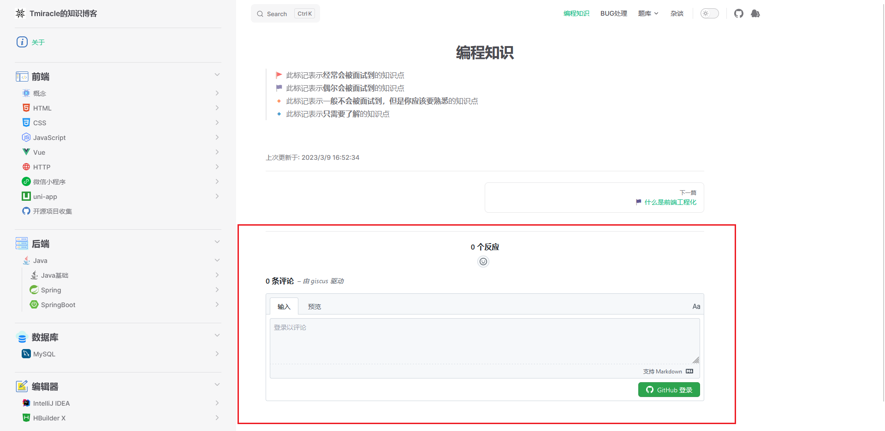

# vitepress-plugin-comment-with-giscus

[](https://www.npmjs.com/package/vitepress-plugin-comment-with-giscus)

EN | [中文文档](README_zh.md)



> `vitepress` comment section plugin based on `giscus`

## Install

```shell
// npm
npm i vitepress-plugin-comment-with-giscus
// yarn
yarn add vitepress-plugin-comment-with-giscus
```

## Usage

```ts
// .vitepress/theme/index.js
import DefaultTheme from 'vitepress/theme';
import giscusTalk from 'vitepress-plugin-comment-with-giscus';
import { useData, useRoute } from 'vitepress';

export default {
    ...DefaultTheme,
    enhanceApp(ctx) {
        DefaultTheme.enhanceApp(ctx);
        // ...
    },
    setup() {
        // Get frontmatter and route
        const { frontmatter } = useData();
        const route = useRoute();
        
        // Obtain configuration from: https://giscus.app/
        giscusTalk({
            repo: 'your github repository',
            repoId: 'your repository id',
            category: 'your category', // default: `General`
            categoryId: 'your category id',
            mapping: 'pathname', // default: `pathname`
            inputPosition: 'top', // default: `top`
            lang: 'en', // default: `zh-CN`
            // ...
        }, {
            frontmatter, route
        });
    }
};
```

For the parameter acquisition method of `giscus`, please refer to：[giscus configuration](https://giscus.app/)

## Extended

If the following code is added to the preface of the article, the comment area will not be generated

```md
---
comment: false
---
```

## more vitepress plugins

You may be interested in these plugins：
[Click me to view more vitepress plugins](https://github.com/T-miracle/vitepress-plugins)
